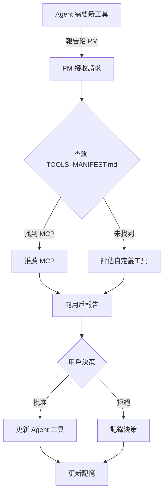
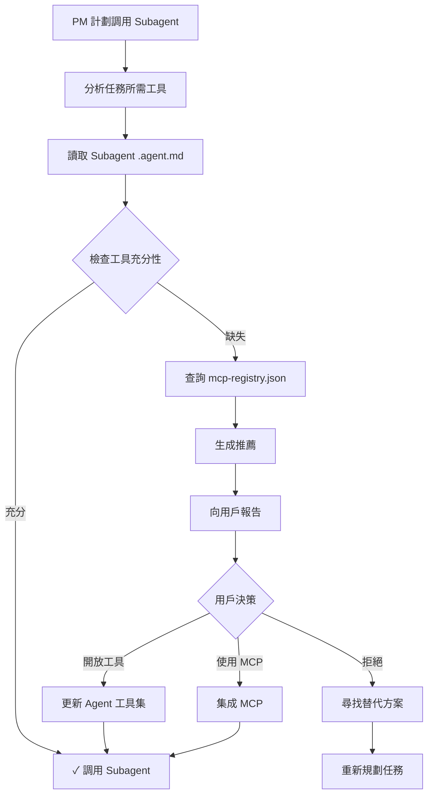

# 權限和工具管理流程

## 📋 快速參考

### PM 的權限檢查清單

在調用任何 Subagent 前，PM 應執行：

```python
# PM 檢查清單

# 1. 分析任務需求
task = "爬取 Dcard 股票版"
required_tools = ["read", "edit", "execute", "search"]

# 2. 查詢 Subagent 現有工具
agent = "Crawler Expert"
current_tools = ["read", "edit", "execute", "search"]  # 從 .agent.md 讀取

# 3. 計算缺失工具
missing_tools = set(required_tools) - set(current_tools)
# 結果: 無缺失 ✓ 可以調用

# 4. 如有缺失，查詢 MCP 資源庫
# - 查看是否有現成的 MCP 解決
# - 評估 Token 消耗
# - 提出推薦方案

# 5. 向用戶報告
if missing_tools:
    report_to_user(agent, missing_tools, mcp_recommendations)
else:
    proceed_with_subagent_call()
```

---

## 🔄 工作流程

### 流程 1: Agent 請求新工具



### 流程 2: PM 調用 Subagent 前檢查



---

## 📁 文件說明

### `.github/tools/TOOLS_MANIFEST.md`

**用途**: 中央工具和 MCP 資源庫

**包含內容**:
- ✅ 所有可用工具的詳細說明
- ✅ 工具矩陣（哪個 Agent 應該有哪些工具）
- ✅ MCP 資源推薦和優先級
- ✅ 集成指南
- ✅ 權限檢查清單

**PM 使用場景**:
```
我需要為 Crawler Expert 尋找爬蟲工具
  → 查看 TOOLS_MANIFEST.md
  → 在"MCP 資源推薦"部分找到 BeautifulSoup MCP
  → 檢查"安全性和集成難度"
  → 推薦給用戶
```

### `.github/tools/mcp-registry.json`

**用途**: 結構化的 MCP 和工具數據庫

**包含內容**:
```json
{
  "mcp_registry": {
    "official_mcps": [...],      // 官方推薦 MCPs
    "community_mcps": [...],     // 社區 MCPs
    "custom_mcps": [...]         // 內部自定義 MCPs
  },
  "agent_capabilities": {
    "Project Manager": {...},
    "Crawler Expert": {...}
    // 每個 Agent 的現有工具和推薦
  },
  "permission_requests": []      // 待處理的權限請求
}
```

**PM 使用場景**:
```javascript
// 查詢推薦 MCP
const recommendations = mcp_registry.agent_capabilities["Crawler Expert"].recommended_mcps
// 結果: ["beautifulsoup-mcp", "pip-mcp", "dcard-crawler-mcp"]

// 檢查 Agent 現有工具
const current_tools = mcp_registry.agent_capabilities["Database Expert"].current_tools
// 結果: ["read", "edit", "search"]

// 檢查最多能開放多少工具
const max_tools = mcp_registry.agent_capabilities["Frontend Engineer"].max_tools
// 結果: 4
```

---

## 🛡️ 安全性檢查

PM 在批准新工具前應檢查：

### 安全性評估模板

```markdown
# 工具安全性評估

**工具名稱**: [名稱]
**請求 Agent**: [Agent 名稱]
**目的**: [使用目的]

## 風險評估

- [ ] 是否會訪問敏感數據?
  - 如是，數據類型? [說明]
  - 保護措施? [說明]

- [ ] 是否需要外部認證?
  - 如是，認證方式? [說明]
  - 密鑰管理? [說明]

- [ ] 是否會修改系統文件?
  - 如是，哪些文件? [說明]
  - 恢復機制? [說明]

- [ ] 是否會消耗大量資源?
  - 估計 Token 增加? [%]
  - 性能影響? [說明]

## 建議

- [ ] 批准完全開放
- [ ] 批准但限制使用範圍
- [ ] 使用替代方案
- [ ] 拒絕

## 理由

[詳細說明]
```

---

## 📊 工具開放決策表

| 情況 | 建議 | 理由 |
|------|------|------|
| Agent 要求額外 Python 工具 | 查詢 MCP | MCP 更輕量，節省 Token |
| Agent 需要執行命令但沒有 `execute` | 評估是否必要 | 執行命令風險較高 |
| Agent 請求訪問敏感記憶 | 檢查隔離策略 | 確保記憶安全 |
| Agent 需要查詢外部 API | 推薦 MCP | 使用官方 MCP 更安全 |
| Agent 要求調用其他 Agents | 僅 PM 允許 | 協調必須通過 PM |

---

## 🔐 記憶更新

每次開放新工具，PM 應更新 `project-state.json`：

```json
{
  "project_name": "Multi-Agent Web Crawler Dashboard",
  "current_phase": "Development",
  
  "agent_permissions": [
    {
      "agent": "Crawler Expert",
      "tool": "ms-python.python",
      "date_approved": "2026-03-16T10:30:00Z",
      "reason": "Python 代碼生成和測試 Dcard 爬蟲",
      "approved_by": "User",
      "token_impact": "low",
      "status": "active"
    }
  ],
  
  "mcp_usage": [
    {
      "mcp": "beautifulsoup-mcp",
      "for_agent": "Crawler Expert",
      "reason": "增強網頁解析能力",
      "integrated": true,
      "date_integrated": "2026-03-16T11:00:00Z"
    }
  ]
}
```

---

## 📝 權限請求模板

當 Agent 提交工具請求時，應包含：

```markdown
# 工具權限請求

**日期**: [日期]
**Agent**: [Agent 名稱]
**請求者**: [若為 PM，寫"PM"]

## 需求

**工具/MCP 名稱**: [名稱]
**當前用途**: [說明用於什麼任務]
**替代方案**: [是否有替代方案]

## 理由

[詳細解釋為什麼需要此工具，不能用現有工具達成]

## 預期影響

- **功能增益**: [新增能力]
- **Token 消耗**: [增加多少]
- **執行時間**: [是否會變慢]
- **風險**: [潛在問題]

## 建議

[PM 的分析和建議]

---

**狀態**: 待批准 / 已批准 / 已拒絕
**決策日期**: [日期]
**決策理由**: [簡要說明]
```

---

## 🎯 最佳實踐

### ✅ PM 應該做

1. **定期審查** MCP 資源庫中的新 MCPs
2. **主動推薦** 適合的 MCP 給 Agents
3. **評估 Token** 消耗，優先推薦 MCP 而非直接開放工具
4. **記錄所有** 工具開放決策和原因
5. **監控 Agents** 的工具使用情況

### ❌ PM 應該避免

1. ❌ 盲目開放所有工具請求
2. ❌ 忘記檢查安全性
3. ❌ 不評估替代方案
4. ❌ 未更新記憶就開放新工具
5. ❌ 允許 Agents 直接互相調用（應通過 PM）

---

## 🔗 相關文檔

- [TOOLS_MANIFEST.md](.github/tools/TOOLS_MANIFEST.md) - 工具資源庫
- [mcp-registry.json](.github/tools/mcp-registry.json) - MCP 註冊表
- [PM Agent 定義](.github/agents/pm.agent.md) - PM 詳細指引

---

**版本**: 1.0  
**最後更新**: 2026-03-16  
**下次審查**: 2026-04-16
